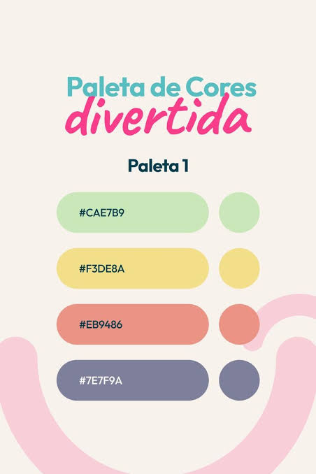

# LiBok

Sistema desktop para organização e controle de uma pequena biblioteca.

<p align="center">
	
</p>

## Sobre o projeto

O LiBok nasceu de uma necessidade real. Minha esposa precisava organizar a biblioteca do trabalho, que é pequena, mas ainda não possuía um sistema de cadastro. Ela pensou em utilizar uma planilha do Excel e me contou a ideia.

O Excel poderia funcionar, mas pensei que seria possível ajudar a tornar esse controle mais dinâmico, organizado e fácil de consultar. Assim nasceu o LiBok: uma aplicação simples para cadastrar, pesquisar e administrar os livros do acervo.

## Objetivos

- Centralizar o cadastro dos livros.
- Facilitar a consulta por diferentes informações.
- Controlar a quantidade e os códigos de registro dos exemplares.
- Evitar o cadastro duplicado do mesmo livro.
- Exibir um resumo visual das categorias cadastradas.
- Substituir controles manuais por uma ferramenta mais dinâmica.

## Funcionalidades

### Dashboard

- Exibe o total de livros cadastrados.
- Apresenta um gráfico de pizza com a quantidade por categoria.
- Mostra uma legenda com quantidade e percentual de cada categoria.
- Cria cores automaticamente para categorias novas.

### Cadastro

- Cadastro de nome, autor, categoria, assunto e quantidade.
- Criação de um campo de código para cada exemplar.
- Validação dos campos obrigatórios.
- Validação da quantidade de exemplares e códigos informados.
- Limpeza automática do formulário após um cadastro realizado.
- Bloqueio de livros com o mesmo nome, ignorando diferenças de maiúsculas, minúsculas, acentos e espaços externos.

### Pesquisa e gerenciamento

- Pesquisa por nome, autor, categoria, assunto ou código de registro.
- Busca sem diferenciação de maiúsculas, minúsculas e acentos.
- Mensagem informando quando nenhum livro é encontrado.
- Exportação de todo o acervo para CSV compatível com Excel.
- Edição dos dados cadastrados.
- Exclusão de livros com confirmação.

## Imagens do aplicativo

### Identidade visual

<p align="center">
	
</p>

### Telas

As telas principais do LiBok são o Dashboard, a Pesquisa e o Cadastro. O Dashboard apresenta o gráfico de categorias, enquanto a tela de Pesquisa permite consultar, editar, excluir e exportar os livros cadastrados.

## Tecnologias utilizadas

- **Python**: linguagem principal da aplicação.
- **CustomTkinter**: criação da interface gráfica desktop com widgets modernos.
- **Tkinter**: recursos nativos da interface, como janelas de confirmação e carregamento de imagem.
- **SQLite**: banco de dados local, leve e sem necessidade de servidor.
- **sqlite3**: módulo padrão do Python utilizado para acessar o banco SQLite.
- **Pillow**: carregamento e exibição otimizada do ícone na tela inicial, quando disponível.
- **Pathlib**: manipulação dos caminhos de arquivos de forma compatível com o sistema operacional.

## Estrutura do projeto

```text
LiBok/
├── database/
│   └── database.py       # Conexão, criação e operações do banco
├── img/
│   ├── icon.ico          # Ícone da aplicação
│   ├── icon.png          # Imagem da tela inicial
│   └── paleta.png        # Paleta de cores da interface
├── pages/
│   ├── dashboard.py      # Dashboard e gráfico de categorias
│   ├── register.py       # Formulário de cadastro
│   └── search.py         # Pesquisa, edição e exclusão
├── index.py              # Inicialização da aplicação e navegação
├── README.md             # Documentação do projeto
└── myenv/                # Ambiente virtual local
```

O arquivo `database/libok.db` é criado automaticamente na primeira execução, caso ainda não exista.

## Como executar

### Pré-requisitos

- Python 3.10 ou superior.
- Windows, macOS ou Linux com suporte ao Tkinter.
- Dependências instaladas no ambiente Python.

### Windows com o ambiente virtual do projeto

No PowerShell, na pasta raiz do projeto:

```powershell
Set-ExecutionPolicy -Scope Process -ExecutionPolicy RemoteSigned
.\myenv\Scripts\Activate.ps1
python index.py
```

Para executar sem ativar o ambiente virtual:

```powershell
.\myenv\Scripts\python.exe index.py
```

### Instalação das dependências

Caso seja necessário configurar outro ambiente virtual:

```powershell
python -m venv myenv
.\myenv\Scripts\Activate.ps1
pip install customtkinter pillow
python index.py
```

## Gerar aplicativo `.exe`

No Windows, use o ambiente virtual do projeto e instale o PyInstaller:

```powershell
.\myenv\Scripts\Activate.ps1
pip install pyinstaller
```

Depois, na raiz do projeto, gere o executável único:

```powershell
pyinstaller --noconfirm --clean --onefile --windowed --name LiBok --icon img\icon.ico --add-data "img;img" index.py
```

O arquivo será criado em `dist\LiBok.exe`. Para usar em outra máquina Windows, copie apenas esse arquivo e abra-o normalmente. O computador de destino não precisa ter Python, CustomTkinter ou Pillow instalados.

Os dados cadastrados pelo executável ficam em `%APPDATA%\LiBok\libok.db`, permitindo que o programa tenha permissão para salvar o acervo e preserve os dados entre execuções.

## Banco de dados

O LiBok utiliza o arquivo local `database/libok.db`. A tabela principal é `books`, com os seguintes dados:

- `name`: nome do livro.
- `author`: autor.
- `category`: categoria.
- `subject`: assunto.
- `quantity`: quantidade de exemplares.
- `registration_codes`: códigos de registro dos exemplares.

Não é necessário instalar ou iniciar um servidor de banco de dados.

## Possíveis evoluções

- Relatórios de livros por categoria.
- Controle de empréstimos e devoluções.
- Cadastro de usuários da biblioteca.
- Backup e restauração do banco de dados.
- Filtros combinados e ordenação dos resultados.
